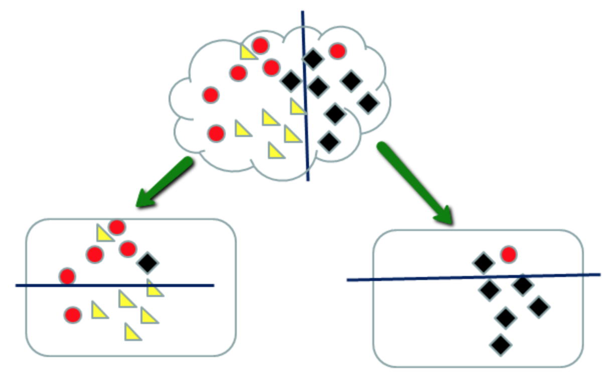

```{r include=FALSE}
rm(list = ls())

# library(tree)      
library(tidyverse)
library(mosaic)  
library(ggdendro)   # dendogram plot--unsupervised learning example
library(rpart)      # regression trees--supervised learning
library(rpart.plot) # plot regression tree

knitr::opts_chunk$set(tidy = FALSE, message = FALSE, warning = FALSE)
options(width = 80)
```


## Announcments 

- **Final Project: Initial EDA - due November 18th (Friday) at 11:59 p.m.**
  - Late submissions with NOT be accepted after 23 November at 11:59 PM. 
- No activity this week 
- No homework this week
- No class on Friday - I will be here to answer questions (like office hours)
- Email me for any grading discrepancies 

**THERE IS STILL A READING QUIZ THIS WEEK**


##  EDA

We have spent most of our time on two subjects in the context of EDA:

1. Data wrangling: getting from the data you are given to the "glyph-ready" data that you need to make a graphic or some other mode to guide interpretation of the data.
2. Data visualization

Visualization works well with 1-3 variables, and in some situations can work with more variables.

## A multivariable graphic (& review)

In 1812, Napoleon Bonaparte attempted to invade Russia in what is known as the **French invasion of Russia** or the **Russian Campaign**. "Napoleon's invasion of Russia is one of the best studied military campaigns in history and is listed among the most lethal military operations in world history. It is characterized by the massive toll on human life: in less than six months nearly a million soldiers and civilians died." ([source](https://en.wikipedia.org/wiki/French_invasion_of_Russia))


#### Minard's Map of French casualties 

Can you identify one or more of the following elements in the graphic?

- Glyphs
- Aesthetics
- Scale
- Guide

 {width=95%} 

[source](http://www.edwardtufte.com/tufte/graphics/minard_lg.gif)


Here is is in English: 


[source](https://www.datavis.ca/papers/jebs.pdf)
This paper also has alternative ways to map this data.


#### We can plot this in `ggplot`

```{r fig.height = 5, fig.width=12}
library(gridExtra)
library(maps)

troops <- read.table("class-notes/week-13/troops.txt", header = T)
cities <- read.table("class-notes/week-13/cities.txt", header = T)
temps <- read.table("class-notes/week-13/temps.txt", header = T) 
temps$date <- as.Date(strptime(temps$date,"%d%b%Y"))

borders <- data.frame(map(.x = "world", .f = ~ . ,  xlim = c(10,50), ylim = c(40, 80), plot = F)[c("x", "y")])

xlim <- scale_x_continuous(limits = c(24, 39))

# Troop Survival
march <-  
ggplot(cities, aes(x = long, y = lat)) +  
geom_path(aes(size = survivors, colour = direction, group = group), data = troops) +
theme(legend.position = "none") +  
geom_point() +  
 geom_text(aes(label = city), hjust = 0, vjust = 1, size = 4) + 
 # scale_size(to = c(1, 10)) +
 scale_colour_manual(values = c("tan","black")) + 
ggtitle("Carte figurative des pertes successives en hommes de l'Armée Française dans la campagne de Russie 1812–1813", subtitle = "[English:] Figurative Map of the successive losses in men of the French Army in the Russian campaign 1812–1813. \n Drawn by M. Minard, Inspector General of Bridges and Roads (retired). Paris, November 20, 1869.") 

 # Temperature 
 temp <- 
   qplot(long, temp, data = temps, geom = "line") +  
   geom_text(aes(label = paste(day, month)), vjust = 1) +  
   xlim + ylim(c(-35, 0)) 
 grid.arrange(march, temp, nrow = 2, heights = c(3, 1.5))

```

 I don't blame you if you prefer Charles Minard's version to the `ggplot2` attempt in this case 

 p.s. I don't take credit for all of the original code; I did the same thing I often recommend you do:   

  - start with working code that does something close (<https://github.com/slygent/statlearningpres/blob/master/minard.r>) 
  - tweak it until it works for your specific purpose 


## Exploration with many variables?

- If we need to relate more variables, a visualization may not suffice
- Statistical/Mathematical representations are an important tool:
    - model formulas, e.g. `lm(Y ~ X1 + X2 + X3)`
    - lots of different types of models
    
#### Side note on formulas 

response variable **~** predictor1 + predictor 2 + ......

- Can handle both numeric (`as.numeric()`) and categorical (`as.factor()`) variables

More advanced: 

- transformations of variables: log(predictor1) or I(predictor1^2)
- interactions: predictor1 * predictor 2
- conditional: response variable ~ predictor1 | predictor 2 
- random effects: (1| predictor1)
- remove the intercept: y ~ -1 + predictor1

#### Side note about linear regression

$$y_i = \beta_0 + \beta_1 x_{1,i} + \beta_2 x_{2,i}  + ... + \epsilon_i$$

- $y_i$ = response variable for data point $i$
- $x_{1,i}$ = 1$^{st}$ predictor variable for data point $i$
- $x_{2,i}$ = 2$^{nd}$ predictor variable for data point $i$
- ... = we can add as many predictors as we would like 
- $\epsilon_i \overset{iid}{\sim} N(0, \sigma^2)$

We are attempting to estimate $\beta_0, \beta_1, \beta_2, ...$. 

Our statistical test is: 

$H_0: \beta_j = 0$ (the j$^{th}$ predictor is **NOT** related to the response variable)

$H_1: \beta_j \neq 0$(predictor is related to the response variable)

Interpretation of $\beta_j$: for ever one unit increase in $x_j$, the response variable changes $\beta_j$ amount HOLDING ALL OTHER VALUES CONSTANT.


## Example: mtcars


#### Research Question

What is the relationship between 1/4 mile time & car characteristics? 


## First look at `mtcars` data

```{r}
#?mtcars
glimpse(mtcars)
head(mtcars)
```


## Exploring our research question in depth

What is the relationship between 1/4 mile time & car characteristics? 


#### Response Variable (Y): 1/4 mile time in seconds

1. Gross horsepower might be relevant.
2. Expect number of cylinders to be associated with fast cars
3. Does weight level matter?
4. Miles per gallon?

```{r}
#Make categorical variables factors 
cols <- c("cyl", "vs", "am", "carb")

mtcars <- mtcars %>%
       mutate(across(c("cyl", "vs", "am", "carb"), as.factor))
str(mtcars)

# fit regression model: lm(Y ~ X, data = [Name of data source])
regressMod <- lm(qsec ~ hp + cyl + wt + mpg, data = mtcars ) 

# recall: extract coefficient estimates from `regressMod` object using `$`
regressMod$coefficients

```

## Interpreting the model?

```{r}
summary(regressMod)
```


## Purposes for modeling

Statistical modeling generally serves to formalize relationships inherent in the data using efficient mathematical approximations.  Some typical purposes for statistical modeling might include: 

- descriptive / exploratory: *what can I learn about the structure of the data in front of me?*
- inferential: *what can these data tell me about a more general population they represent?*
- predictive: *what outcomes might we expect in the future based on what we have observed so far?*

These are not necessarily mutually exclusive, but it's sometimes useful to consider them as distinct purposes.


### How might these purposes be interpreted in the context of our regression model of cars data?


## Another formalism: Regression trees

####  Idea of recursive partitioning




#### Regression tree with `mtcars` data

```{r}
# use help to learn about `rpart` function... note the similarity of syntax
treeMod <- rpart(qsec ~ hp + cyl + wt + mpg, data = mtcars)

prp(treeMod)  # use help to learn about the `prp( )` function
```

We can look at a different model too, 

How does horse power, weight, and number of cylinders affect mileage? 


```{r}
# use help to learn about `rpart` function... note the similarity of syntax
treeMod <- rpart(mpg ~ hp + cyl + wt, data = mtcars)

prp(treeMod)  # use help to learn about the `prp( )` function

```


#### Linear Regression vs Regression Trees

compare/contrast: syntax, output, interpretation, assumptions, conclusions, etc


## 1/4 mile time vs all other variables in the data

```{r}
# what do you suppose the "dot" means here?
treeModFull <- rpart(qsec ~ . , data = mtcars)

prp(treeModFull)
```


#### More info

[Here](https://www2.stat.duke.edu/~rcs46/lectures_2017/08-trees/08-tree-regression.pdf) is a link to more indepth information about regression trees. 


## Unsupervised learning intro

- If you do the opposite of our binary partitioning process, we call it hierarchical clustering
- Here we join elements based on their similarity to one another (according to available information)
- Why "Unsupervised"?

```{r}
# compute distance matrix 
Dists <- dist(mtcars)

# hierarchical cluster analysis
Dendrogram <- hclust(Dists)

# plot dendogram of cars
ggdendrogram(Dendrogram)
```


## Some key concepts in Machine Learning (ML) / Statistical Learning 

1. Supervised vs unsupervised learning
2. Model assumptions & nonparametric methods (e.g., Recursive partitioning)
3. Protect against "overfitting" the data
    - *cross-validation* tests out-of-sample performance to diagnose overfitting among other purposes
    - *bias-variance trade-off* balance model performance between overfitting and underfitting
    - *regularization* (e.g. Ridge Regression & LASSO) impose model constraints to prevent overfitting
4. Dimension reduction 


#### Remarks

- **Goal**: characterize patterns or structure present in the data

- **Supervised** learning: values of both inputs (e.g. "X" variables) *and* outputs (e.g. "Y" variable) are used
    - frequently used in exploratory, inferential, & predictive applications
    - examples: 
        - classification and regression trees (CART);
        - support vector machines;
        - simple linear regression

- **Unsupervised** learning: values of only the inputs (e.g. "X" variables) are used
    - commonly used for grouping/clustering similar observations
    <!-- - Goal: minimize dissimilarity w/in clusters; maximize dissimilarity b/w clusters -->
    - variable/dimension reduction (i.e. compressing the number of "inputs" in the data)
    - **Data mining**: often refers to unsupervised learning for exploratory purposes

- **Tools**: R has lots of useful packages for ML
    - `rpart`: used in the course notes today 
    - `party`: demonstrated in the book
    - `e1071`, `nnet`, `randomForest`, `caret`, `gbm`, `SuperLearner`, 
    - other software have great tools too (e.g., python's `scikit-learn` library)


<!-- #### Additional examples -->
<!-- - Taxonomy: classification of organisms, minerals, etc.   -->
<!--     - Ancestry: e.g., use of DNA to characterise human ancestral heritage -->
<!--     - Phylogenetics: model evolutionary tree based on heritable traits (e.g. DNA) -->
<!-- - Astronomy: classification of distant stars and other features -->
<!-- - Forensic Science: analysis of bullet markings for firearm identification -->


